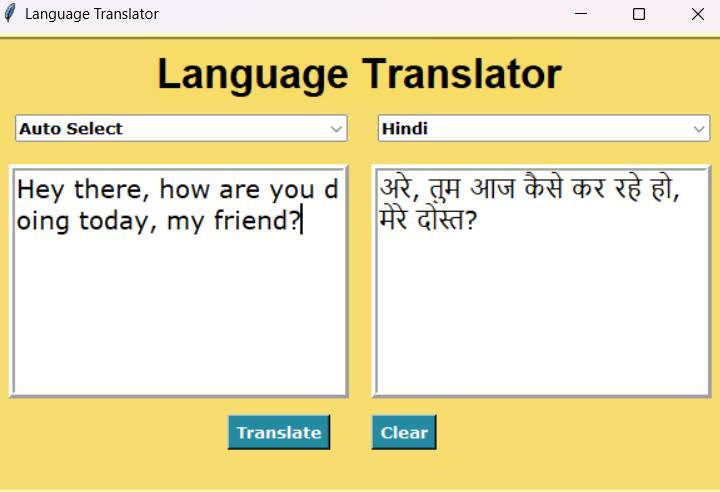

# Language Translator

## Overview

The Language Translator is a Python application that uses the `googletrans` library to provide text translation services between multiple languages. It features a user-friendly graphical interface built with `tkinter`, allowing users to easily translate text and clear the input fields.




## Features

- **Multi-language Support**: Translate text between a wide range of languages using Google Translate API.
- **Graphical User Interface**: Built with `tkinter` for a simple and intuitive user experience.
- **Text Input and Output**: Enter text to be translated and view the translated text in the application.
- **Language Selection**: Choose from a comprehensive list of languages for translation.

## Installation

To set up and run the application, follow these steps:

1. **Clone the Repository**

   ```bash
   git clone https://github.com/yourusername/translate.git
